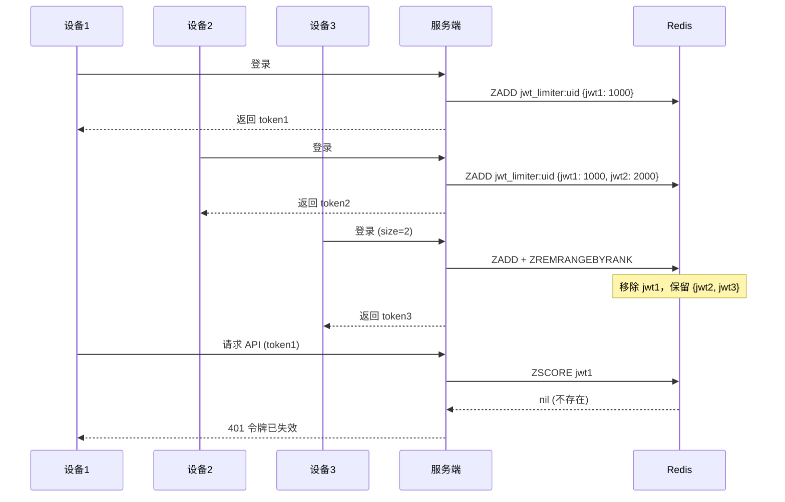

## 前言

在实际业务中，我们经常需要限制用户的同时登录设备数量。比如视频会员只允许同时在 2 台设备上登录，第 3 台设备登录时会把最早的那个踢下线。

本文介绍如何在 Go-Zero 框架中实现这个功能。

## 实现思路

使用 Redis 的有序集合（Sorted Set）存储用户的 JWT 令牌：
- member: JWT 令牌
- score: 登录时间戳

每次登录时，添加新令牌并移除超出限制的旧令牌。利用 Lua 脚本保证操作的原子性。

## 核心代码

### Lua 脚本

```lua
-- limiter.lua
local key = KEYS[1]
local jwt = ARGV[1]
local score = tonumber(ARGV[2])
local size = tonumber(ARGV[3])

-- 添加或更新令牌
redis.call('ZADD', key, score, jwt)

-- 移除超出限制的旧令牌
redis.call('ZREMRANGEBYRANK', key, 0, -size-1)

-- 检查令牌是否存在（可能刚刚被移除）
local exists = redis.call('ZSCORE', key, jwt)
if exists then
    return 1
else
    return 0
end
```

脚本逻辑：
1. `ZADD` 将新令牌加入集合，score 为时间戳
2. `ZREMRANGEBYRANK` 按 score 排序后，删除排名靠前（最旧）的令牌，只保留最新的 `size` 个
3. 检查当前令牌是否还在集合中，返回 1 表示有效，0 表示被踢出

### Go 封装

```go
package jwtLimiter

import (
	"context"
	_ "embed"
	"fmt"

	"creaibo/common/utils"
	"github.com/zeromicro/go-zero/core/stores/redis"
)

//go:embed limiter.lua
var luaScript string

type JwtLimiter struct {
	redis *redis.Redis
	size  int64 // 允许同时登录数量
}
```

> **关于 `//go:embed`**
> 
> 这是 Go 1.16+ 引入的 embed 特性。`//go:embed limiter.lua` 是编译器指令，作用是在编译时将同目录下的 `limiter.lua` 文件内容自动读取并赋值给 `luaScript` 变量。
> 
> 好处：
> - 部署时不需要带 `.lua` 文件，脚本已嵌入二进制
> - 代码和脚本放一起，方便维护
> - 编译时检查文件是否存在，避免运行时找不到文件
> 
> 注意：需要 `import _ "embed"` 才能使用该特性。

```go
func NewJwtLimiter(redis *redis.Redis) *JwtLimiter {
	return &JwtLimiter{
		redis: redis,
		size:  2,
	}
}

func (j *JwtLimiter) Add(ctx context.Context, uid string, score float64, jwt string) (bool, error) {
	key := utils.GenJwtLimiterKey(uid)
	scoreStr := fmt.Sprintf("%f", score)
	sizeStr := fmt.Sprintf("%d", j.size)

	result, err := j.redis.EvalCtx(ctx, luaScript, []string{key}, jwt, scoreStr, sizeStr)
	if err != nil {
		return false, fmt.Errorf("执行令牌限制脚本失败: %w", err)
	}

	return result.(int64) == 1, nil
}

func (j *JwtLimiter) Remove(ctx context.Context, uid string, jwt string) error {
	key := utils.GenJwtLimiterKey(uid)
	_, err := j.redis.ZremCtx(ctx, key, jwt)
	return err
}
```

### Key 生成

```go
package utils

func GenJwtLimiterKey(userId string) string {
	return "jwt_limiter:" + userId
}
```


## 使用方式

### 用户登录时

```go
func (l *LoginLogic) Login(req *types.LoginReq) (*types.LoginResp, error) {
	// ... 验证用户名密码 ...
	
	// 生成 JWT
	token, err := generateJwt(user.Id)
	if err != nil {
		return nil, err
	}
	
	// 添加到限制器
	limiter := jwtLimiter.NewJwtLimiter(l.svcCtx.Redis)
	ok, err := limiter.Add(l.ctx, user.Id, float64(time.Now().Unix()), token)
	if err != nil {
		return nil, err
	}
	
	if !ok {
		// 理论上新登录不会返回 false，除非并发极高
		return nil, errors.New("登录失败")
	}
	
	return &types.LoginResp{Token: token}, nil
}
```

### JWT 中间件验证

```go
func JwtAuthMiddleware(limiter *jwtLimiter.JwtLimiter) rest.Middleware {
	return func(next http.HandlerFunc) http.HandlerFunc {
		return func(w http.ResponseWriter, r *http.Request) {
			token := r.Header.Get("Authorization")
			
			// ... 解析 JWT 获取 uid ...
			
			// 检查令牌是否有效（是否被踢出）
			ok, err := limiter.Add(r.Context(), uid, float64(time.Now().Unix()), token)
			if err != nil || !ok {
				http.Error(w, "令牌已失效，请重新登录", http.StatusUnauthorized)
				return
			}
			
			next(w, r)
		}
	}
}
```

### 用户登出时

```go
func (l *LogoutLogic) Logout() error {
	uid := l.ctx.Value("uid").(string)
	token := l.ctx.Value("token").(string)
	
	limiter := jwtLimiter.NewJwtLimiter(l.svcCtx.Redis)
	return limiter.Remove(l.ctx, uid, token)
}
```

## 流程图



## 注意事项

1. **并发安全**：Lua 脚本在 Redis 中是原子执行的，不用担心并发问题
2. **数据量可控**：每个用户最多存 `size` 个令牌，不会无限增长
3. **自然淘汰**：用户重新登录时，旧令牌会被自动踢掉
4. **size 配置化**：建议把 `size` 放到配置文件中，方便调整

## 总结

通过 Redis Sorted Set + Lua 脚本，我们实现了一个简洁高效的 JWT 并发登录限制方案。核心思想是利用有序集合的排序特性，自动淘汰最旧的令牌，保证同时在线设备数不超过限制。
